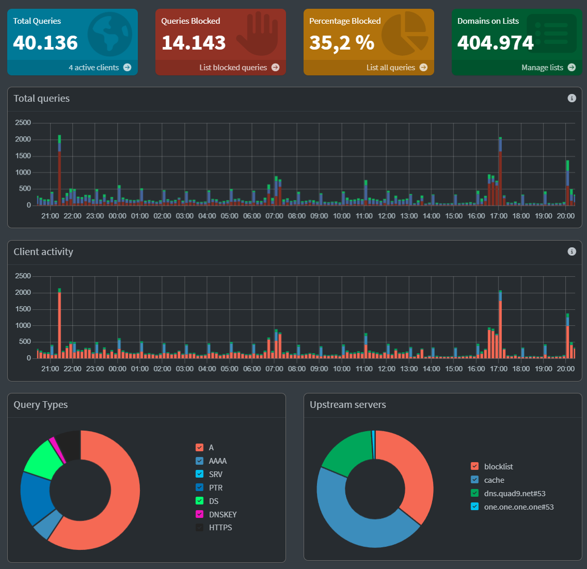

# Pi-hole como DNS y DHCP de toda la red doméstica

> Parte del proyecto [`homelab-proxmox-t14`](https://github.com/Santiago-Sysadmin/homelab-proxmox-t14). Aquí se documenta en detalle el servicio Pi-hole: despliegue, migración del DHCP, operación y copias.
>
> **Política de publicación:** este repositorio no contiene direcciones IP, rangos, MACs, nombres de red Wi-Fi, listados de dispositivos ni configuración que facilite mapear la red. Se usan marcadores como `IP_PIHOLE`, `IP_ROUTER` o `RANGO_DHCP`.

**EN —** Pi-hole (v6) runs in a tiny LXC container on Proxmox and serves as both the **DNS filter and the DHCP server** for the whole home network. This repo documents the DHCP migration away from the router (with a tested rollback plan), IP reservations, safe configuration changes, weekly Teleporter backups and DNS-health monitoring. Documentation is in Spanish; no network details are published.

## Resumen

Pi-hole v6 se ejecuta en un contenedor **LXC** de Proxmox con muy pocos recursos (1 vCPU, 512 MB). Hace dos trabajos para toda la LAN:

1. **DNS** con filtrado de anuncios y rastreadores mediante listas de bloqueo.
2. **DHCP**, sustituyendo al servidor DHCP del router. Así cada dispositivo aparece por su nombre en el registro de consultas.



## Arquitectura

```text
Clientes de la LAN
   │  DHCP: concesión + DNS = Pi-hole
   ▼
LXC Pi-hole (Proxmox) ──► DNS upstream (resolutores públicos)
   │
   └── Listas de bloqueo (~400 000 dominios)
Router: solo puerta de enlace (su DHCP está desactivado)
```

## Qué se ha hecho

### 1. Despliegue y migración del Pi-hole anterior

- Exportación de la configuración previa con **Pi-hole Teleporter**.
- Despliegue en un LXC independiente (arranque prioritario: el primero, porque el resto de servicios dependen del DNS).
- Importación de listas, reglas, upstreams y configuración.
- Diagnóstico y recuperación del acceso web tras restaurar una configuración de puerto personalizada.
- Validación con `nslookup`/`dig` y comprobación de consultas reales desde varios clientes.
- IPv6 desactivado en el DNS para evitar respuestas que los clientes no pueden usar.

### 2. Migración del DHCP del router al Pi-hole

Plan seguido (detalle en [`docs/migracion-dhcp.md`](docs/migracion-dhcp.md)):

1. Inventario previo de los dispositivos y de las direcciones fijas que ya existían.
2. Elección del rango del DHCP para **no pisar** equipos con IP estática.
3. Copia de la configuración antes de tocar nada.
4. Activar el DHCP en Pi-hole y **desactivar el del router** (nunca dos servidores a la vez).
5. Reservas por MAC para los equipos de infraestructura.
6. Verificación: concesiones, resolución de nombres y renovación de un cliente.
7. Plan de vuelta atrás probado en teoría: reactivar el DHCP del router y desactivar el del Pi-hole.

Decisiones:

- **Concesión de 72 h** (en lugar de 24 h): menos renovaciones y menos cambios de IP en dispositivos domóticos.
- **Reservas por MAC** para el host, el propio Pi-hole, Home Assistant y los dispositivos que otras aplicaciones usan por IP.
- Las IPs de los servicios críticos se fijan **también en el propio equipo**, no solo en el DHCP: si el DHCP falla, siguen accesibles.

### 3. Operación y cambios seguros

Reglas aplicadas:

- Cualquier cambio de configuración recarga FTL y el DNS **deja de responder unos segundos**: se avisa y se verifica después.
- **Copia del fichero de configuración antes de cada cambio**, con nombre que indica el motivo y la fecha.
- Cambios de reservas: leer el valor actual completo, añadir la entrada y reescribirlo entero.
- Comprobaciones tras cada cambio: `dig +short @IP_PIHOLE dominio`.

Comandos de referencia en [`docs/operacion.md`](docs/operacion.md).

### 4. Copias de seguridad

- Cada semana se exporta el **Teleporter** (listas, ajustes, DHCP y reservas) dentro de la copia de configuración del host.
- El contenedor completo entra en las copias diarias a Proxmox Backup Server.
- Se realizó una restauración de prueba en otro guest para validar el procedimiento.

### 5. Observabilidad

- Un servicio del host (`netwatch`) comprueba cada pocos segundos si el DNS del Pi-hole resuelve y registra solo las **transiciones** (ok → fallo).
- Home Assistant avisa si el DNS cae durante un tiempo.
- Los registros ayudan a distinguir entre un fallo del Pi-hole, un fallo del router y un corte de la línea.

## Decisiones técnicas

| Decisión | Motivo |
|---|---|
| LXC en lugar de VM | Consumo mínimo y copias rápidas. |
| Pi-hole como DHCP | Nombres de dispositivo en las consultas DNS y reservas versionadas en Teleporter. |
| IP fija en el equipo además de reserva | Independencia del propio DHCP para los servicios críticos. |
| No cambiar el rango de la red de golpe | Riesgo alto: un error puede dejar sin acceso al servidor y obligar a intervenir físicamente. Si se retoma, se hará por fases. |
| Arranque prioritario | El resto de servicios necesita DNS al arrancar. |

## Lecciones aprendidas

- Una integración que usa la **IP** de un aparato (domótica) se rompe cuando el DHCP le cambia la dirección: conviene reservarla por MAC.
- Un DHCP nuevo puede dejar al descubierto equipos con IP estática que chocan con el rango; el inventario previo evita sorpresas.
- Dejar siempre el procedimiento de vuelta atrás escrito antes de empezar.

## Pendientes

- [ ] Valorar usar el Pi-hole como DNS también para los dispositivos que se conectan por VPN.
- [ ] Revisar periódicamente las listas de bloqueo y los falsos positivos.
- [ ] Documentar en un diagrama el flujo DNS/DHCP completo.
